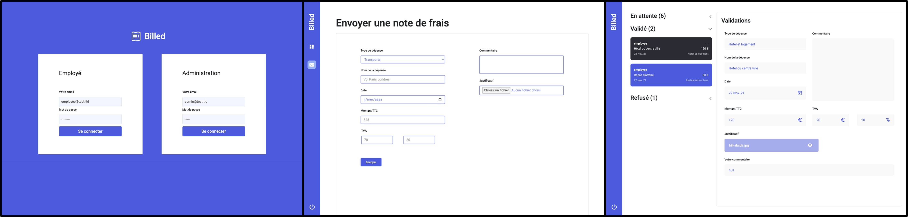

<br />
<br />
[](https://developer.mozilla.org/docs/Web/JavaScript)
[](https://jestjs.io)
[](https://testing-library.com/docs/)
<br />

Billed is an expense management app for employees and administrators. Employees can upload their receipts (invoices and receipts) and track the status of their reimbursements. Administrators have access to a centralized dashboard to view, accept, or reject requests. The app offers a clear view of expenses, a receipt preview system, and easy navigation tailored to each user's needs.

<br />  [see the docs of mission](https://openclassrooms.com/fr/paths/877/projects/809/728-scenario)
<br />  [see the issues of mission](https://openclassrooms.notion.site/a7a612fc166747e78d95aa38106a55ec?v=2a8d3553379c4366b6f66490ab8f0b90)
<br />  [see the tests End to End](https://drive.google.com/drive/u/0/folders/1V4meq8n_Ukb2IqkMdA7xoDj-XPrbiM6f)



<br /> 

 **Clone the Billed App project**

```bash
git init
git clone https://github.com/JulienDevFront/billedApp
cd billedApp
npm install
```
<br />

 **Clone only the backend of Billed App**

```bash
git init
git clone https://github.com/OpenClassrooms-Student-Center/Billed-app-FR-Back.git
cd billedApp
npm install
npm run run:dev
```
<br />

 **Clone only the frontend of Billed App**

```bash
git init
git clone https://github.com/OpenClassrooms-Student-Center/Billed-app-FR-Front.git
cd billedApp
npm install
npm install -g live-server
live-server
```
<br />

 **Run a test**
```bash
cd Billed-app-FR-Front
npm test
```